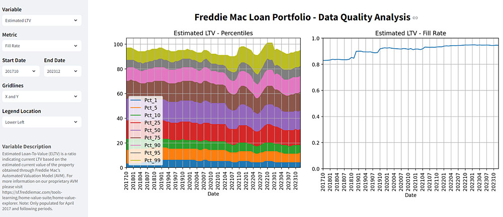
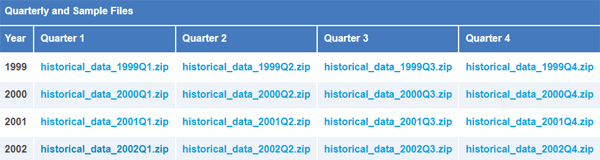
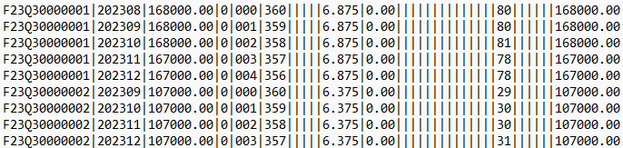
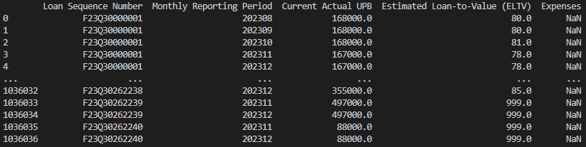
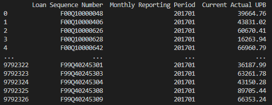

# dq_analysis - Data Quality Analysis
The main goal of this project was to create a simple interactive dashboard visualizing the properties of time-dependent distributions of data such as loan attributes, which could be helpful in the detection of possible temporal discontinuities and other anomalies related to data quality. The Freddie Mac loan dataset, chosen for this purpose, was also analyzed from the point of view of portfolio loan counts by reporting month and by origination date, the main intention being to help the user understand how the data is organized. Please click the screenshot below to access the dashboard app on Streamlit.

### 1. Dataset
The Freddie Mac single-family loan-level dataset was downloaded from https://www.freddiemac.com/research/datasets/sf-loanlevel-dataset. The data on the website was organized into 99 quarterly zip files starting from 1999 Q1 and ending at 2023 Q3. Each zip archive, **historical_data_yyyymm.zip**, would contain a loan origination data file, named **historical_data_yyyymm.txt**, and a time series loan data file, named **historical_data_time_yyyymm.txt**. Only the time series data was used in this project. Please note that access to the Freddie Mac data download zone requires authentication and - since I could not identify a csrf token normally used in the login protocol in such cases - I was not able to automate the download process at this point.

> ###### Screenshot of single-family quarterly loan dataset links at Freddie Mac download site
> 

Each quarterly txt file contained monthly data pertaining to the loans originated at that particular fiscal quarter, including the loan's full history until December 2023, which is the last monthly date in the dataset. For example, **historical_data_time_2020Q3.txt** would contain data for all loans originated at August, September or October 2020, starting at the year/month of origination and continuing monthly onwards until December 2023. On average, there would be over 25 million records and almost half a million unique loans in each quarterly file, adding up to over 2.5 billion records and almost 47 million unique loans for all periods combined - see [<ins>this summary</ins>](data/freddie_mac/standard/summaries/Monthly_Performance_Dataset_Summary.csv) for details.

### 2. Data Wrangling
The quarterly txt files were pipe-separated and contained no header; the column names and types were instead provided in a separate Excel file, saved here in an enhanced form as [<ins>time_data_layout.csv</ins>](cfg/time_data_layout.csv). The task of reformatting the txt file into a dataframe was handled by the **reformat_original_data()** function of the FreddieMac class defined in [<ins>prepare_data.py</ins>](src/prepare_data.py). 

> ###### Sample of quarterly loan data file in the original pipe-separated format
> 

> ###### Sample of the quarterly data file reformatted and saved as parquet
> 

An initial attempt to aggregate all time series data into a single file was quickly abandoned due to hitting memory limits, even just for a single variable (loan attribute). In the next attempt, the quarterly files were looped over to extract monthly data that would then be progressively appended to each monthly extract for the selected variable. That approach eliminated the memory problems but suffered from the limitation of including only a subset of loans present in the portfolio at each date until all quarterly files were processed, which would be a lengthy task taking many hours to complete. 

Eventually, the monthly data was extracted by looping over all quarterly files inside a loop over dates (yyyymm), which was executed by the **extract_monthly_by_month()** function of the FreddieMac class. This approach offered the convenience of splitting the extraction process into monthly batches and also allowed to limit the range of the data selected for plotting by setting the start and end dates - in this case 201701 and 202312. As an example, the 201701 monthly extract would contain almost 10 million records with just as many loans, all of them originated between January 1999 and January 2017.

> ###### Sample of monthly loan data file for Current Actual Unpaid Balance (UPB) at January 2017
> 

All extract files, both quarterly and monthly, were saved on disk in the parquet format - initially using pandas and later with pyarrow. The latter offered a speed improvement by a factor of 1.7-5.0, depending on the task, while also reducing almost two-fold the size of parquet output on disk.

It was not necessary to convert the date column, **Monthly Reporting Period**, from integer to datetime for the purpose of plotting, as the sort order would be preserved for both data types. However, the column had to be converted from integer to string so it could be treated as a categorical variable - otherwise we would see step-wise jumps in the temporal profiles of loan attributes between December of one year and January of the following year. Conversion to string would also be faster and easier to implement than conversion to datetime.

[comment]: # "Comment on the variables selected"